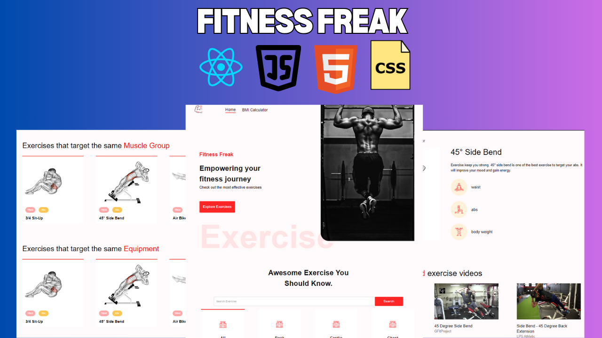

# Fitness Freak

Fitness Freak is a comprehensive fitness website developed using React and the ExerciseDB API. The site provides users with a vast database of exercises and includes a BMI calculator to help users track their fitness progress and make informed decisions about their health routines.



## Features

- **Exercise Database**: Access a wide range of exercises fetched from the ExerciseDB API.
- **BMI Calculator**: Integrated BMI calculator to help users monitor their health and fitness levels.
- **Responsive Design**: Optimized for various devices to ensure a consistent user experience.

## Getting Started

Follow these instructions to set up the project locally.

### Prerequisites

- Node.js (v14.x or later)
- npm (v6.x or later) or yarn (v1.22.x or later)

### Installation

1. Clone the repository:
   ```bash
   git clone https://github.com/akash202004/fitness-freak
   cd fitness-freak
   ```
